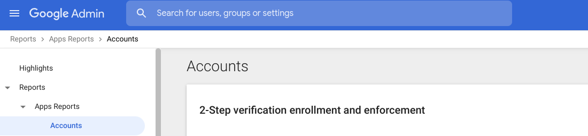
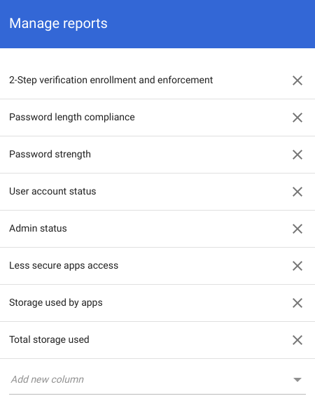

## Protect root / global admins account(s) with Multi-Factor Authentication

### Enforce uniform MFA to company-owned resources [MFA][]

Protect your user accounts and company data with a wide variety of MFA verification methods such as push notifications, Google Authenticator, phishing-resistant <a href="https://cloud.google.com/titan-security-key">Titan Security Keys</a>, and using your Android or iOS device as a security key.  If Cloud Identity is your identity provider (IdP), you can implement 2SV in several ways. If you use a third-party IdP, check with them about their 2SV offering.

You can select different levels of 2SV enforcement:
- Optional—employee decides if they will use 2SV.
- Mandatory—employee chooses the 2SV method.
- Mandatory security keys—employee must use a security key.

### **Validation**
As your organization's administrator, you can monitor your users' exposure to data compromise by opening a security report. The security report gives you a comprehensive view of how people share and access data and whether they take appropriate security precautions. You can also see who installs external apps, shares a lot of files, skips 2-Step Verification, uses security keys, and more. 

### **Open your Security Report**
- Access <a href="https://admin.google.com">admin.google.com</a>
- Select Reports
- Select App Reports or User Reports
- Select Accounts

</img>

Reports can be customized to include *password length compliance, password strength, admin status* amongst many other attributes

</img>

[MFA]: https://cloud.google.com/identity/solutions/enforce-mfa
