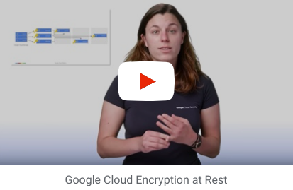
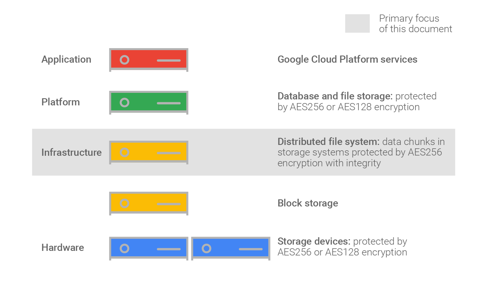
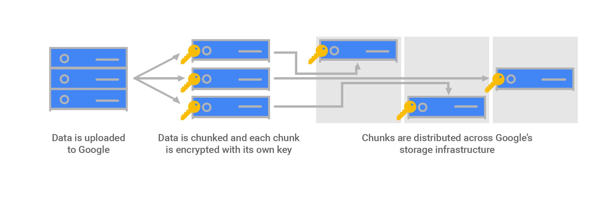

# Encryption at rest in Google Cloud

### Comprehensive Encryption at rest Information: [Encryption at Rest Whitepaper][]

<a href="https://www.youtube.com/watch?v=Svz2KHE1mdM&autoplay=1">
</img>
</a>

## **Google's default encryption**

### **Encryption of data at rest**
Google Cloud Platform **encrypts all customer data at rest without any action required from you**, the customer.Google Cloud Platform encrypts all customer data at rest without any action required from you, the customer.   Google uses a common cryptographic library, Keyczar, to implement encryption consistently across almost all Google Cloud Platform products.  This includes data stored in cloud storage, computer engine persistent disks, cloud SQL databases, virtually everything.

### **Layers of Encryptions**
Google uses several layers of encryption to protect data. Using multiple layers of encryption adds redundant data protection and allows us to select the optimal approach based on application requirements.

</img>

All data stored in GCP is encrypted with a unique data encryption key (DEK).  More specifically, data is then broken into sub-file chunks for storage. Each chunk can be up to several gigabytes in size. Each chunk of data is then encrypted at the storage level with a unique key.  Two chunks will not have the same encryption key even if they are part of the same Google Cloud storage object owned by the same customer or stored on the same machine.

</img>

Encrypted data chunks are then distributed across Google's storage infrastructure.
This partition of data, each using a different key, means that the blast radius of a potential encryption key compromise is limited to only that data chunk. The data encryption keys are encrypted with or wrapped by key encryption keys or KEKs.
The wrapped data encryption keys are then stored with this data. The key encryption keys are exclusively stored and used inside Google's central Key Management Service or KMS.  KMS held keys are also backed up for disaster recovery purposes and are indefinitely recoverable. 

Decrypting data requires the unwrapped data encryption key, DEK, for that data chunk. When a Google Cloud Platform service accesses an encrypted chunk of data: For each chunk the storage system pulls the wrapped DEK stored for that chunk and calls a Google Key Management Service to retrieve the unwrapped data encryption key for that data chunk. The KMS then passes the unwrapped DEK back to the storage system which is then able to decrypt the data chunk.

***By default this entire process is enabled by default and is fully managed by Google, including the key encryption keys. There is absolutely nothing to enable or configure.***

Google also manages the key rotation schedule. This schedule varies slightly depending on the service, but the standard rotation period for KEKs is every 90 days. 

**Encryption at rest options include:**
- Encryption by default
- Customer-managed encryption keys (CMEK) using Cloud KMS
- Customer-supplied encryption keys (CSEK)

[Encryption at Rest Whitepaper]: https://cloud.google.com/security/encryption-at-rest/default-encryption
